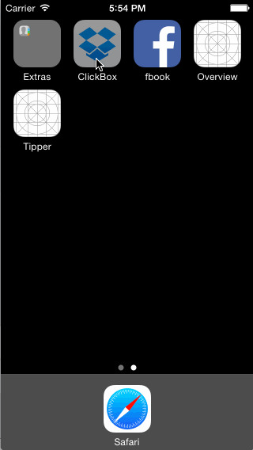

# ClickBox (Fake Dropbox) Demo
iOS Designers Bootcamp Week 1 Assignment

This is a click prototype for creating an account/sign in experience in Dropbox.  
Time spent: 5 hours spent in total

**User can tap through welcome screens:**  
  * [x] User can *swipe* through the 3 welcome screens.

**User can follow the create user flow:** 
  * [x] On the create user form, the user can tap the back button to go to the page where they can sign in or create an account.
  * [x] Before creating the account, user can choose to read the terms of service.
  * [x] After creating the account, user can view the placeholders for Files, Photos, and Favorites as well as the Settings screen.
  * [x] User can log out from the Settings screen.
  
**User can follow the sign in flow:**

  * [x] User can tap the area for "Having trouble signing in?"
  * [x] User can log out from the Settings screen.

**Optional Tasks**
  * [ ] Optional: Add a detail view for one of the files and implement favoriting the file.
  * [ ] Optional: Add UITextFields for the forms so you can actually type in them and handle dismissing the keyboard.
  * [x] Optional: You should be able to swipe through the welcome screens instead of just tapping them.

Walkthrough of DropBox:

GIF created with [LiceCap](http://www.cockos.com/licecap/).
